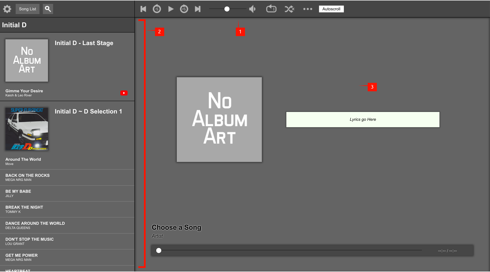

# **Simple Music Player**

This is the readme for the **Simple Music Player**, a HTML/JavaScript/PHP application that allows you to use any web browser as your personal media player.

The **SMP** utilizes the following coding langauges:
* HTML5
* CSS3
* JavaScript
* PHP 7.*
* SQLite

---

## Versions
You can view the changelog inside ``changelog.md``.

### Latest Stable Version:
The latest stable release of the SMP is **Version 1.0.3 *alpha* **.

---

## Installation

The SMP can operate on any localhost server that is able to process SQLite and PHP. It is recommended that the file organization within the root folder is kept as-is - adjusting file locations may cause errors to occur in the player

When the player is opened for the first time within a browser, any missing files and directories will be initialized by the player automatically. These files and directories include:
* ``scripts/database.sql`` - the SQLite-based database file that contains all information required by the SMP
* ``media/`` - the directory that contains all the local media files uploaded into the SMP by the user
* ``art/`` - the directory that contains all the local artwork images uploaded into the SMP by the user

---

## Usage

### Basic Functionality
The SMP's functionality can be summarized as such:
* Play audio (mp3) and video (mp4, YouTube embed) media
* Adjust looping and shuffling of albums
* Autoscrolling Lyrics
* Media Info Editing, including album art and adding dynamic lyrics

### General UI
The SMP's UI is determined as such:

#### **1) Body Header** - The header bar that spans the top of the screen.
This header bar contains 4 parts:
* *Settings (Gear icon)*: Lets you adding local media and youtube videos as embed to your local version of the SMP. Also lets you change global settings of the whole SMP (i.e Song List position)

* *Song List*: Toggles the appearance of the Song List column (#2)

* *Search Bar*: Lets you access a search bar to look up media and play them from the search bar for quick access.

* *Player Buttons*: lets you control the player. Available buttons include:
	* *Pause*
	* *Play*
	* *Forward +5 seconds*
	* *Backward -5 seconds*
	* *Previous media (if looped or shuffled)*
	* *Next media (if looped or shuffled*)
	* *Volume level*
	* *Loop single media, loop album, or no loop*
	* *Shuffle album, or no shuffle*
	* *Edit current media*
	* *Autoscroll dynamic lyrics / toggle lyrics (if video)*

#### **2) Song List** - The column that contains all the media added to your local version of the SMP.
The Song List has several functions:
* Shows all media, including songs and videos, in the following hierarchy:
		1. Album Artist
		2. Album
		3. Songs
* Contains the following forms:
	* Add Media
	* Add Embed
	* Edit Media Item
	* Edit Album Artwork
	* Edit Global Settings

#### **3) Player** - The main container for the audio and video player

* Audio player and Video player are hidden/shown depending on what kind of media is being played
* Audio media shows **album artwork** and **lyrics** (if lyrics are available with the current media)

---

## Restarting the SMP

If you wish to restore the SMP to its original state prior to any installations, you must delete the file ``scripts/database.sql``. Deletion of this file will cause the SMP to re-initialize a new SQL file to use as a database, thereby resetting the player.

From there, old files kept in the ``media/`` directory can be reinserted into the SMP again. If you wish to restart the ``media/`` directory, you must simply remove the directory from the root directory of the SMP - the SMP will re-initalize this directory upon reloading the page on the browser. The same applies to the ``art/`` directory.

---

## Changelog

The changelog is available for viewing within the file ``changelog.md``.
